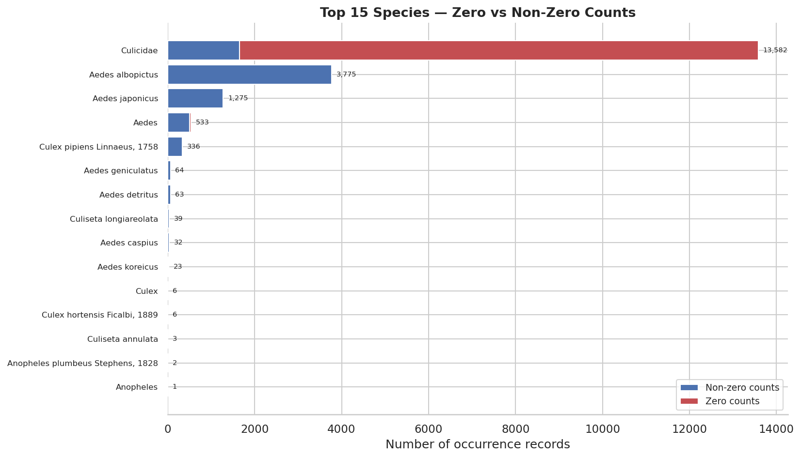
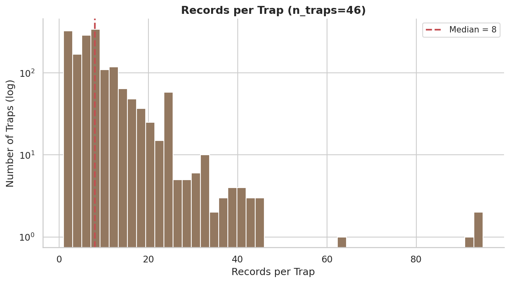
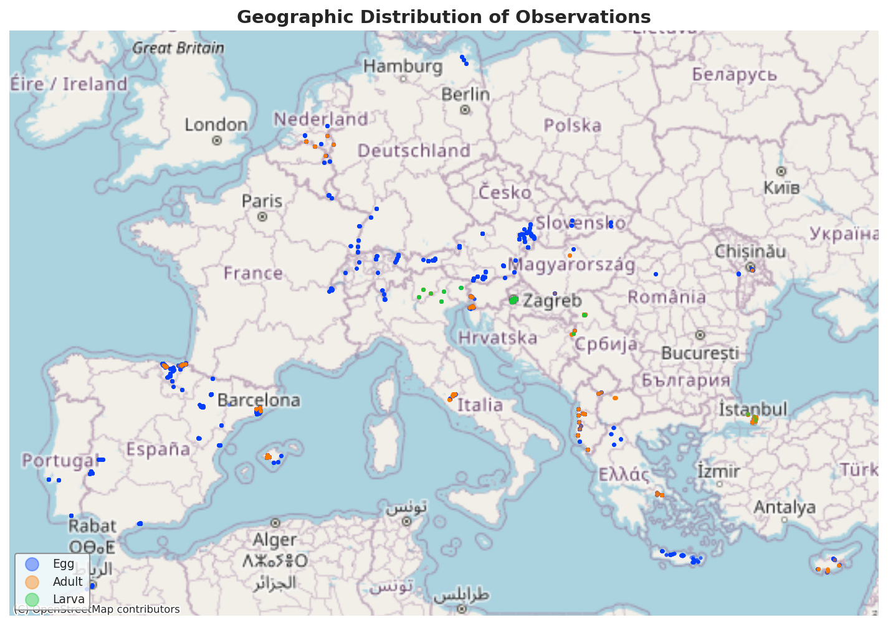
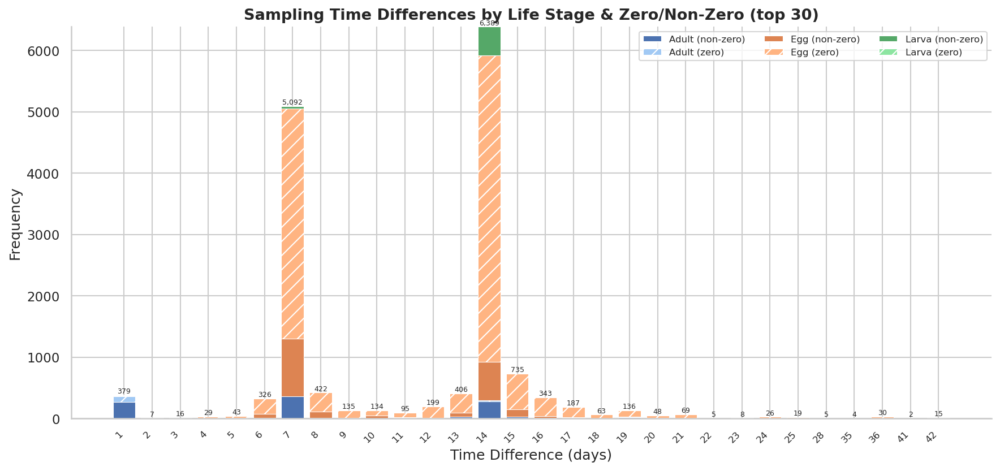
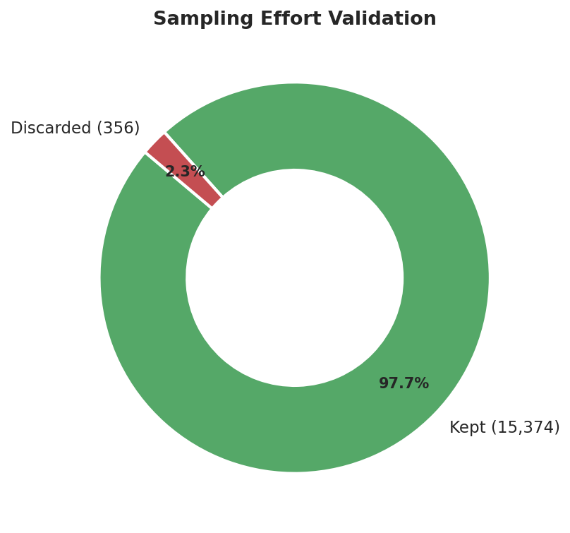
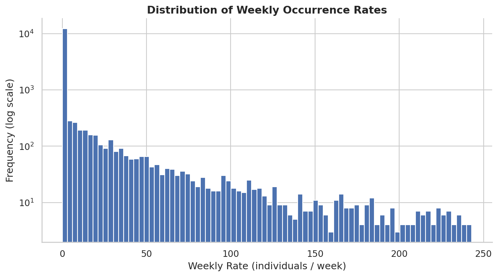
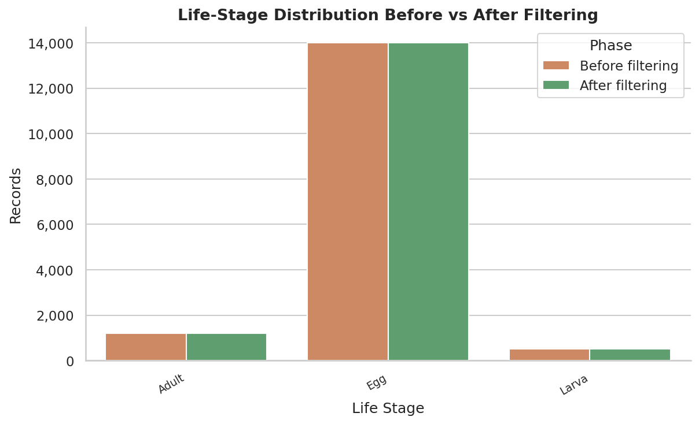
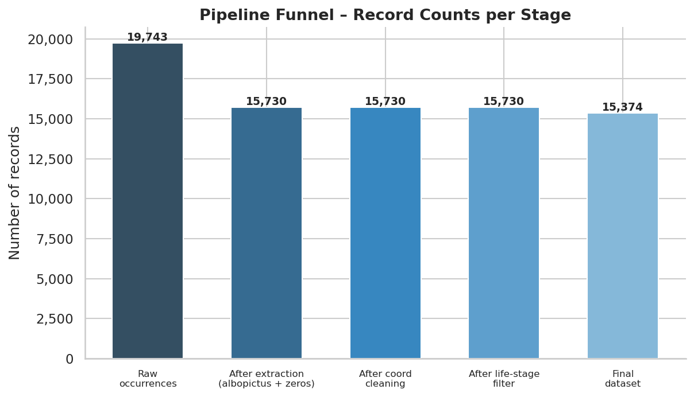
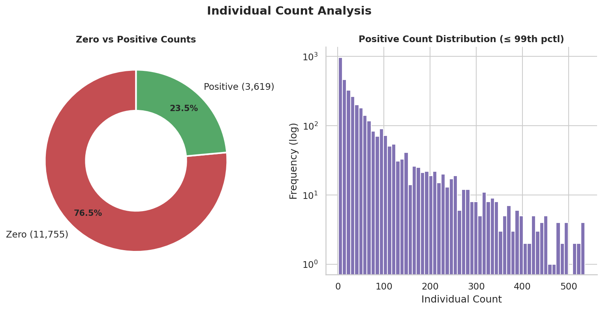
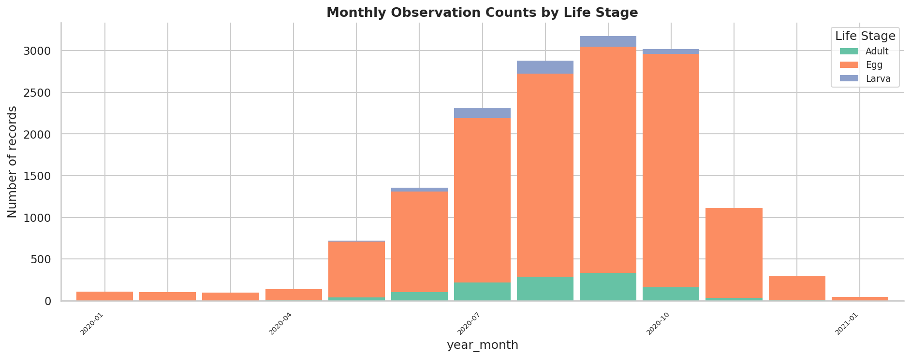

# Aedes albopictus — Data Processing Report

This document describes the pipeline that transforms raw mosquito surveillance data (AIM-SURV Darwin Core Archive v2.3) into the final **Aedes albopictus** analysis dataset. Each section corresponds to a processing step; key statistics are drawn from the pipeline run and complemented by automatically generated figures.

---

## 1. Raw Data Loading

The pipeline ingests two tab-separated files (`event.txt` and `occurrence.txt`) from the archive.

| Metric | Value |
|--------|------:|
| Total occurrence records | 19,743 |
| Total event records | 20,930 |
| Unique scientific names | 18 |
| Records with `individualCount = 0` | 11,955 |

### Life-stage distribution (raw)

| Life Stage | Records |
|------------|--------:|
| Egg | 17,376 |
| Adult | 1,761 |
| Larva | 593 |
| egg (lowercase) | 13 |

> **Note:** 13 records have `egg` (lowercase) as life stage — these are treated as a separate category by the raw data and are later excluded by the case-sensitive life-stage filter.

### Top 15 species

The chart below shows the 15 most frequent species, split into **non-zero** (positive detections) and **zero** (negative observations) counts. The family-level record *Culicidae* dominates because every ovitrap sampling event without species-level identification falls under this label — the vast majority of those are zero-count (negative) observations.

*Figure 1 — Top 15 species by occurrence count, coloured by zero vs non-zero individual counts.*

---

## 2. Aedes albopictus Extraction

Records matching **Aedes albopictus (Skuse, 1894)** are selected. All zero-count records (negative observations across *all* species) are appended because absence data is essential for occurrence-rate modelling.

| Metric | Value |
|--------|------:|
| Albopictus records (all) | 3,775 |
| Zero-count records (all species) | 11,955 |
| Zero-count records (albopictus only) | 0 |
| Zero-count records (other species) | 11,955 |
| **Total after concatenation** | **15,730** |

### Life-stage counts (albopictus only)

| Life Stage | Records |
|------------|--------:|
| Egg | 2,198 |
| Adult | 1,053 |
| Larva | 524 |

All 3,775 albopictus records have a positive `individualCount`; the 11,955 zero-count records come from other species (predominantly *Culicidae* family-level negatives).

---

## 3. Coordinate Cleaning

Coordinates are standardised: degree symbols (`°`) are stripped, commas are replaced by dots, and values are cast to numeric. Records with unparseable or missing coordinates are dropped.

| Metric | Value |
|--------|------:|
| Records before cleaning | 15,730 |
| Rows with `°` in latitude | 600 |
| Rows with `°` in longitude | 600 |
| Rows with comma-decimal latitude | 1 |
| Rows with comma-decimal longitude | 0 |
| Rows with NaN coords after parsing | 0 |
| Records dropped (missing coords) | 0 |
| **Records after cleaning** | **15,730** |

All 600 degree-symbol rows and the single comma-decimal row were successfully parsed — no records were lost.

---

## 4. Trap Identification

Each unique `(decimalLatitude, decimalLongitude)` pair is assigned a numeric trap identifier via `ngroup()`.

| Metric | Value |
|--------|------:|
| Unique traps | 1,668 |
| Total measures | 15,730 |
| Min records per trap | 1 |
| Median records per trap | 8 |
| Max records per trap | 95 |

*Figure 2 — Distribution of the number of records per trap (log-scaled y-axis). The red dashed line marks the median (8 records).*

*Figure 3 — Geographic distribution of trap observations, coloured by life stage. A basemap is shown if `contextily` and `geopandas` are installed.*

---

## 5. Temporal Processing

The `eventDate` field (format `YYYY-MM-DD/YYYY-MM-DD`) is split into `start_date` and `end_date`. The sampling duration (`time_diff`) is calculated in days. Records with a zero-day duration are set to 1 day to avoid division-by-zero in rate calculations.

| Metric | Value |
|--------|------:|
| Zero time-diff records fixed to 1 day | 7 |
| Min `time_diff` (after fix) | 1 |
| Max `time_diff` | 203 |

*Figure 4 — Distribution of sampling time differences (top 30 values), stacked by life stage. Solid bars represent non-zero individual counts; hatched bars represent zero counts.*

---

## 6. Sampling Effort Validation

The reported `samplingEffort` (in days) is compared to the calculated `time_diff`. Records where the absolute difference exceeds **2 days** are flagged for removal.

| Outcome | Records |
|---------|--------:|
| Kept (\|diff\| ≤ 2) | 15,374 |
| Discarded (\|diff\| > 2) | 356 |
| NaN (could not compare) | 0 |

**97.7%** of records pass the validation; only 356 (2.3%) are discarded.

*Figure 5 — Proportion of records kept vs discarded by the sampling effort validation.*

---

## 7. Weekly Rate Calculation

A standardised weekly occurrence rate is computed as:

$$\text{weeklyRate} = \frac{7 \times \text{individualCount}}{\text{time\_diff}}$$

This normalises counts to a common 7-day window, making observations with different sampling durations comparable.

*Figure 6 — Histogram of weekly occurrence rates (log-scaled y-axis, clipped at 99th percentile). The large spike at 0 corresponds to the zero-count (negative) observations.*

---

## 8. Final Filtering

Two filters are applied sequentially:

1. **Life-stage filter** — only `Egg`, `Adult`, and `Larva` records are retained (case-sensitive).
2. **Validation filter** — only records that passed the sampling-effort check (`keep == True`) are retained.

| Metric | Value |
|--------|------:|
| Records before filtering | 15,730 |
| Records after life-stage filter | 15,730 |
| Records removed by validation | 356 |
| **Final records** | **15,374** |
| Final unique traps | 1,648 |
| Final zero-count records | 11,755 |

### Life-stage counts before vs after filtering

| Life Stage | Before | After |
|------------|-------:|------:|
| Egg | 13,995 | 13,995 |
| Adult | 1,211 | 1,211 |
| Larva | 524 | 524 |

The life-stage filter removed **0 records** in this run because all records already belonged to one of the three valid categories (the 13 lowercase `egg` records were from other species and not part of the extracted dataset). The validation filter removed 356 records.

*Figure 7 — Life-stage counts before and after filtering.*

*Figure 8 — Record counts at each pipeline stage. The largest reduction comes from the initial extraction (19,743 → 15,730); subsequent steps preserve most records.*

---

## 9. Final Dataset Overview

The final dataset contains **15,374 records** across **1,648 unique traps**. Key characteristics:

- **76.5%** of records are zero-count (negative observations), reflecting the surveillance design where most traps do not detect albopictus on a given visit.
- **Egg** is the dominant life stage (13,995 records), consistent with ovitrap-based surveillance.
- The dataset spans multiple years with seasonal peaks visible in the monthly time series.

*Figure 9 — Left: proportion of zero vs positive individual counts. Right: histogram of positive counts (≤ 99th percentile, log y-axis).*

*Figure 10 — Monthly observation counts stacked by life stage, showing clear seasonal patterns with peaks in summer months.*

---

## Output Files

| File | Location | Description |
|------|----------|-------------|
| `albopictus.csv` | `output_data/` | Final filtered dataset (CSV) |
| `albopictus.pkl` | `output_data/` | Final filtered dataset (pickle) |
| `albopictus_summary.json` | `output_stats/` | Pipeline run statistics (JSON) |
| `albopictus_report.md` | `output_stats/` | This report |
| `plots/*.png` | `output_stats/plots/` | All figures referenced above |

---

*Report based on `albopictus_summary.json` produced by `albopictus.py` and plots produced by `plot_stats.py`.*
